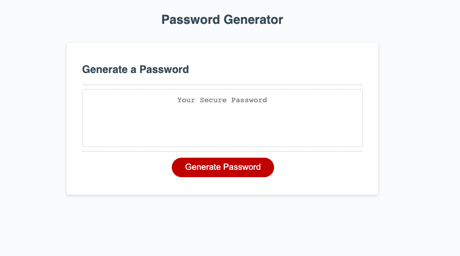
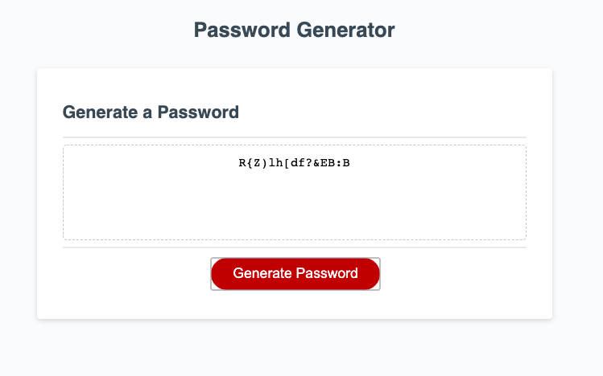

# Password Generator

## Summary

Password Generator runs in the browser, featureing dynamically updated HTML and CSS powered by JavaScript.

## Table of Contents

* [Deployed Application](#deployed-application)
* [Description](#description)
* [User Story](#user-story)
* [Screen Shots](#screen-shots)
* [Links](#links)
* [Contributors](#contributors)

## Deployed Application

(https://sydneypo.github.io/password-generator/)[ https://sydneypo.github.io/password-generator/]

## Description

The Password Generator allows employees to generate a random password following the prompt criteria the user selects to include in their password.

## User Story

```
AS AN employee with access to sensitive data
I WANT to randomly generate a password that meets certain criteria
SO THAT I can create a strong password that provides greater security

GIVEN I need a new, secure password
WHEN I click the button to generate a password
THEN I am presented with a series of prompts for password criteria
WHEN prompted for password criteria
THEN I select which criteria to include in the password
WHEN prompted for the length of the password
THEN I choose a length of at least 8 characters and no more than 128 characters
WHEN prompted for character types to include in the password
THEN I choose lowercase, uppercase, numeric, and/or special characters
WHEN I answer each prompt
THEN my input should be validated and at least one character type should be selected
WHEN all prompts are answered
THEN a password is generated that matches the selected criteria
WHEN the password is generated
THEN the password is either displayed in an alert or written to the page
```

## Screen Shots




## Links

GitHub: [https://github.com/Sydneypo/password-generator](https://github.com/Sydneypo/password-generator)
Deployed App: [https://sydneypo.github.io/password-generator/](https://sydneypo.github.io/password-generator/)

## Contributors

* Sydney Porter